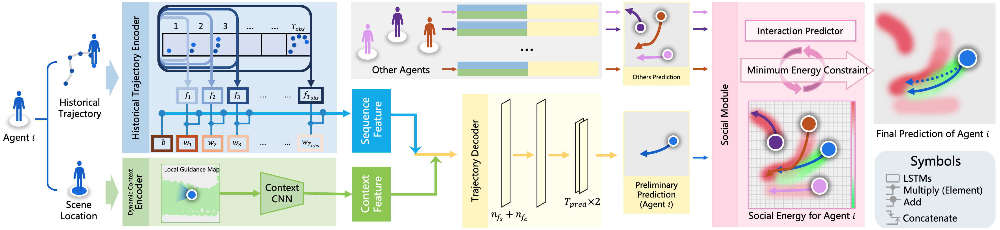

<!--
 * @Author: ConghaoWong
 * @Date: 2019-12-20 09:37:18
 * @LastEditors: Conghao Wong
 * @LastEditTime: 2020-09-09 13:34:24
 * @Description: file contentz
 -->

# Codes for BGM: Building a Dynamic Guidance Map without Visual Images for Trajectory Prediction

## The BGM Model

<div align='center'></img></div>

BGM

## Requirements

## Pre-Trained Models

## Training New Models on ETH-UCY datasets

The original  ETH-UCY datasets (contains ETH-eth, ETH-hotel, UCY-zara1,2,3 and UCY-univ1,3,examples) are included in `./data/eth` and `./data/ucy` with the true position in `.csv` format.
To train a new model on these datasets, you can use the commands above as an example:

```bash
python main.py \
    --test_set 0 \
    --epochs 500 \
    --batch_size 5000 \
    --lr 0.001 \
    --model_name example_model
```

More options can be seen below in section `Options`.
Your new model will be saved at `./logs/YOUR_TRAINING_TIME_YOUR_MODEL_NAME/`.
(For example `./logs/20200909-120030example_model`)

## Training New Models on Your Own Datasets

## Evaluate Models

### Prepare model and data

The fully saved model should contain at least (i) a model weight `YOUR_MODEL_NAME.h5` file and (ii) a training args `YOUR_MODEL_NAMEargs.npy` file.
If there is no test inputs file `YOUR_MODEL_NAMEtest.npy`, you shoud make your own test datas into the format BGM used by the following commands:

```bash

```

### Run the evaluation

You can run the evaluation of your model by the following commands:

```bash
python main.py \
    --load YOUR_MODEL_DIR/YOUR_MODEL_NAME \
    --draw_results 1
```

### Visualized Results

You can set the evaluate arg `--draw_results` to `1` to enable saving visualized results.
For eth, hotel, zara1 and zara2 in ETH-UCY dataset, we have already calcutated their mapping parameters from real world positions to video-pixel positions in `./visual.py` as follows:

```python
...
class TrajVisual():
    def __init__(self, ...):
        self.video_path = ['path_for_set_0', ..., 'path_for_set_n']
        self.paras = [[sample_rate, frame_rate], ...]
        self.weights = [
            [Wx1, bx1, Wy1, by1],
            [np.array(H2), Wx2, bx2, Wy2, by2],
            ...
        ]
...
```

You need change the above video path list `self.video_path` to each video of your dataset.
If your dataset is the record with real world positions, you should calculate your transformation matrix `H` (optional) or the linear mapping weights `W` and `b` for each axis and write to `self.weights`.
Besides, you should also correct the frame rate of your videos and the sample rate of your dataset.

Default save path of these visualized results is `./YOUR_MODEL_DIR/VisualTrajs/`.

## Model Options

You can custom these options both on model compents and training or evaluation.
Note that all items that need a bool type of inputs takes integer `0` and `1` instead of `False` and `True`. 

**Environment options**:

- `--gpu`: (Optional) Choose which GPU the model training or evaluation on.
Parameter should be a positive integer.
- `--verbose`: (Coming Soon) Set if model gives output logs.
Default is `True`.

**Model options**:

- `--obs_frames`: Length of historical trajectories.
Default is `8`.
- `--pred_frames`: Length of predictions.
Default is `12`.
- `--dropout`: The rate of dropout.
Default is `0.5`.
- `--calculate_social`: Controls whether the model predict agent's neighbors trajectories.
Default is `False`.
It will be set to `True` automatically when `--sr_enable` has been set to `True`.
- `--sr_enable`: Controls whether enable the Social Module.
Default is `False`.

**Social module options**:

- `--g`